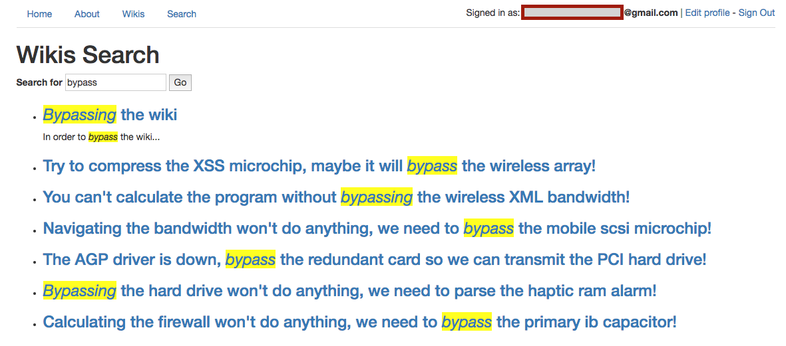

## Wikkr
#### Written in Ruby, HTML & CSS.

You can checkout Wikkr [here](https://warm-brook-93872.herokuapp.com/). Create your own wikis today!

### Features:

* Support admin, standard, and premium roles
* Create public wikis as a standard user
* Upgrade account using [Stripe](https://stripe.com/)
* Create private wikis as a premium or admin user
* Add and remove collaborators for private wikis
* Render Markdown syntax using [Redcarpet gem](https://github.com/vmg/redcarpet)
* Search wikis using [Elasticsearch](https://www.elastic.co/products/elasticsearch)

